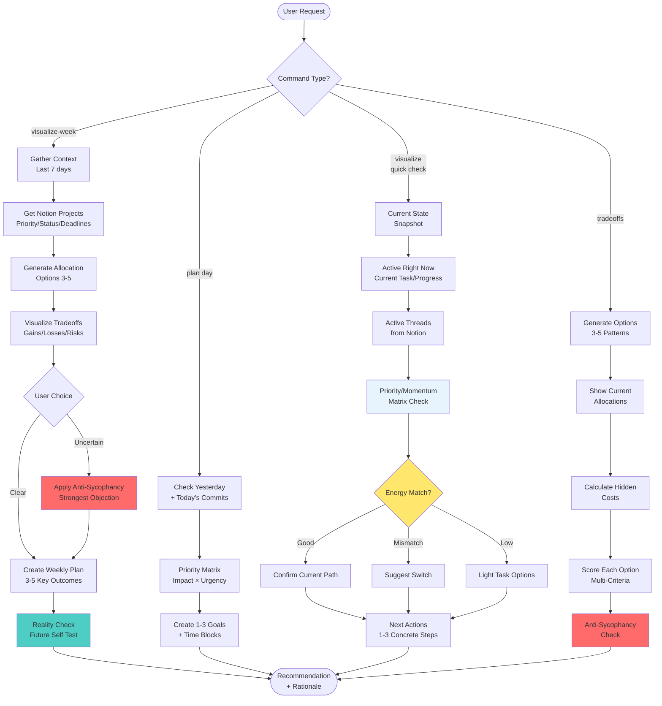

# GTD (Getting Things Done)

<!-- Notion Links (update here if URLs change) -->
<!-- Q1 Projects Database (Source of Truth): https://www.notion.so/mindamyers/Q1-Projects-2026-3173caf373e0816d8f32dce784c1346f -->
<!-- Weekly Planning Template: https://www.notion.so/mindamyers/Researching-TEMPLATE-3163caf373e0805884edc85dd48f3438 -->

Executive function support for weekly and daily planning, helping you focus on what's most important right now.

**Source of Truth:** Notion Q1 Projects | 2026 database
**Local Storage:** `personal/areas/productivity/weekly-plans/` (optional markdown cache)

## Trigger Phrases

- "let's plan my week" → Full weekly planning with tradeoff visualization
- "let's plan my day" → Daily planning for today
- "/gtd visualize-week" → Show this week's visual plan
- "/gtd visualize" → Show what's needed right now (today/current)
- "/gtd tradeoffs" → Show allocation options and tradeoffs
- "help me organize my week"
- "help me prioritize"
- "what should I work on right now"

## What This Skill Does

This skill acts as an **executive function assistant** that helps you:

1. Review your current projects and commitments
2. **Visualize tradeoffs** between different ways to spend your time
3. Identify what needs attention this week/day
4. Prioritize tasks based on impact and urgency
5. Create a realistic plan you can execute
6. Access Notion via MCP to view your task system

**Important:** This skill focuses on **NOW** – what needs to be done this week or today. For the underlying organizational framework and standards, see the PARA skill.

## Project Types Framework

The Q1 Projects database uses a **Project Type** taxonomy to distinguish between different kinds of work:

### Active Project

**What it is:** A concrete project with specific deliverables and an end date.

**Characteristics:**
- Has defined start and end dates
- Clear completion criteria
- Status progresses through workflow (Backlog → In Progress → Completed)
- Can be blocked by dependencies
- May relate to an Ongoing Project or Habit via shared tags/category

**Examples:**
- "Build portfolio website" (30 hours, ends April 15)
- "Complete BlueDot Unit 3" (10 hours, ends March 30)
- "Write Substack post on multi-agent safety" (5 hours, ends March 25)

**Filtering:** `"Project Type" = "Active Project" AND "Status" != "Completed"`

**Tracking:** Standard project management - track progress %, update status, complete by deadline

---

### Habit/Routine

**What it is:** A daily or weekly recurring activity with no end date.

**Characteristics:**
- No end date (NULL)
- Status stays "In Progress" indefinitely
- Track completion via sub-items (daily/weekly check-ins)
- Cannot block other projects
- Not counted toward "project completion" metrics

**Examples:**
- "Medication & supplement schedule" (daily)
- "Daily journaling" (daily)
- "Weekly review" (weekly)

**Filtering:** `"Project Type" = "Habit/Routine"`

**Tracking:** Create sub-items for each occurrence (check-in entries). Can track streaks or frequency, but no "completion" state.

---

### Ongoing Project

**What it is:** An open-ended area of responsibility with vague or no end date. More aligned with PARA "Areas" than traditional projects.

**Characteristics:**
- Optional/vague end date (or NULL)
- Status stays "In Progress"
- Track progress via milestones (child pages/sub-items)
- Active Projects may relate to this area via shared tags/category
- Represents ongoing responsibility, not discrete deliverable

**Examples:**
- "Job search" (applying to roles, vague end when hired)
- "Work with Anusha" (case studies, ongoing collaboration)
- "Maintain WellAware codebase" (open-ended maintenance)

**Filtering:** `"Project Type" = "Ongoing Project"`

**Tracking:** Create child pages or sub-items for milestones/sessions. Example: Job search might have milestones like "Applied to 5 roles", "Had interview with Meta", "Updated resume".

**Relationship to Active Projects:** Active projects can relate to Ongoing Projects via shared tags. For example:
- Ongoing Project: "Job search" (tagged "🔵 Job Search")
- Active Project: "Build portfolio site" (also tagged "🔵 Job Search", 30 hours, deadline April 15)

---

### Template

**What it is:** A reference template for creating new projects.

**Characteristics:**
- Status is irrelevant (hidden from active views)
- Category = "Template"
- Used as starting point when creating new projects
- Never appears in timeline or active project views

**Examples:**
- "P | PROJECT_TEMPLATE" (standard project template)
- "Quick Win Template (<=3 hours)"

**Filtering:** `"Project Type" = "Template"`

**Visibility:** Hidden from all views except Templates Library

---

### Decision Matrix: Which Type to Use?

| Question | Active Project | Habit/Routine | Ongoing Project | Template |
|----------|----------------|---------------|-----------------|----------|
| Has end date? | ✅ Yes, specific | ❌ No | ❌ No or vague | N/A |
| Clear deliverable? | ✅ Yes | ❌ No | ❌ Not concrete | N/A |
| Repeats regularly? | ❌ No | ✅ Yes | ⚠️ Sessions may | N/A |
| Can be "completed"? | ✅ Yes | ❌ Never | ❌ Never | N/A |
| Tracks progress? | ✅ % to completion | ⚠️ Streaks | ⚠️ Milestones | ❌ No |
| Example duration | Days to months | Indefinite | Months to years | N/A |

**For complete details:** See `.claude/skills/gtd/references/project-type-definitions.md`

## Decision Flow



**Text Version:**

**Weekly (`visualize-week`):** Context (7d) → Notion projects → Options (3-5) → Tradeoffs → Choice → Plan (3-5 outcomes) → Reality check

**Daily (`plan day`):** Yesterday + Today → Priority matrix → 1-3 goals

**Quick Check (`visualize`):** Current state → Active threads → Priority/momentum matrix → Energy match → Next actions

**Tradeoffs (`tradeoffs`):** Generate options → Show allocations → Hidden costs → Multi-criteria scoring → Anti-sycophancy check

See `references/example-workflows.md` for detailed workflows.

## Tradeoff Visualization

**When:** Weekly planning, priorities shift, feeling stuck, "/gtd tradeoffs"

**Process:**
1. Generate 3-5 allocation patterns (Ship+Apply, Build+Learn, Hybrid, Infrastructure)
2. Show tradeoffs for each (❌ give up, ✅ gain, ⚠️ risks)
3. Score on key criteria (Career, Portfolio, Learning, etc.)
4. Calculate hidden costs (context switching, opportunity cost)
5. **Apply anti-sycophancy:** State strongest objection + Future Self Test

**Template:** See `references/tradeoff-matrix-template.md` for format and examples.

## Commands

**`/gtd visualize-week`** - Weekly plan (capacity, active threads, momentum, daily allocation) + creates markdown/Notion page

**`/gtd visualize`** - Current focus (what's needed right now, next actions, energy match)

**`/gtd tradeoffs`** - Allocation options with full tradeoff analysis

## Quick Visualization (Current State)

This is your go-to command for understanding what needs attention RIGHT NOW.

**When to use:**
- Feeling stuck or unsure what to work on next
- Need a quick status check mid-day
- Want to see active threads and priorities
- Energy/task matching for current moment

**What it shows:**
```
Current Focus: [Day, Date, Time]
━━━━━━━━━━━━━━━━━━━━━━━━━━━━━━━━━━━━━━━━━━━━━

Active Right Now:
┌──────────────────────────────────┐
│ 🛠️  [Current Task]               │
│    Time: X-Xh remaining          │
│    Energy: High/Medium/Low       │
│    Progress: XX% done            │
└──────────────────────────────────┘

Active Threads (from Notion):
  🔴 [Project Name]     (Priority, Momentum) [⚠️ if stuck]
  🟡 [Project Name]     (Priority, Momentum)
  🟢 [Project Name]     (Priority, Momentum)

Next Actions:
  1. [Specific next step] (time estimate)
  2. [Another action] (time estimate)
  3. [Third priority] (time estimate)

Energy Match: ✅ Good / ⚠️ Mismatch / ❌ Poor
  [Context about time of day]
  [Match between task and energy]
  [Any relevant patterns]

Recommendation:
[1-2 sentence specific guidance based on current state]
```

**Key Features:**
- **Active Right Now:** What you're currently working on (if anything)
- **Active Threads:** Projects from Notion with priority/momentum indicators
- **Next Actions:** Concrete, actionable next steps (not vague todos)
- **Energy Match:** Whether current task fits your energy level
- **Recommendation:** Specific guidance, not generic advice

**Momentum/Priority Matrix:**
- 🎯 High priority + high momentum = **Do First**
- ⚠️ High priority + low momentum = **Why stuck?** (shows warning)
- 🤔 Low priority + high momentum = **Reconsider priority?**
- ⏸️ Low priority + low momentum = **Pause/Archive**

## System Integrations

**For detailed integration information, see:** `references/integration-details.md`

### Quick Summary:

**PARA:** Uses PARA as organizational foundation (Active Projects → Planning input)

**Conversational History:** Primary context source via SQLite index
- `/conversational-history recent` - Last 7 days
- `/conversational-history today` - Today only
- `/conversational-history 3h` - Last 3 hours

**Notion MCP:** Source of truth for projects
- Reads Q1 Projects database (status, priority, deadlines, progress)
- Creates weekly planning pages (optional)
- Does NOT write todos automatically

**Priority Tracking:** High/Medium/Low combined with momentum
- 🎯 High priority + high momentum = Do First
- ⚠️ High priority + low momentum = Why stuck?
- 🤔 Low priority + high momentum = Reconsider?
- ⏸️ Low priority + low momentum = Pause/Archive

**Project Type Filtering:** Use Project Type property to filter views
- Active Projects: What needs completion this week/month
- Habits: Daily/weekly routines (separate tracking)
- Ongoing Projects: Areas requiring attention (milestone tracking)
- Templates: Hidden from active views

## Core Principles

**Decision Support:** Identify key edges (what matters most, what's blocking, what's realistic, what to say NO to) + provide supporting facts (even contradictory)

**Executive Function:** Working memory (externalize commitments) · Planning (break down, sequence, estimate) · Task initiation (smallest first step) · Time management (realistic + buffers) · Cognitive flexibility (pivot when needed)

**Anti-Sycophancy:** Lead with strongest objection FIRST, then acknowledge strengths. Prevents false validation, uncovers blind spots.

## Implementation Details

**For technical implementation details, see:** `references/implementation-guide.md`

Key points:
- Use conversational-history SQLite index for recent context (not file scanning)
- Check Notion MCP for active projects and priorities
- Extract momentum patterns from last 7 days of work
- Progressive disclosure: summary first, details on request
- Filter by Project Type to show appropriate views

## Usage Notes

- **Weekly Planning:** 15-30 minutes on Sunday evening or Monday morning
- **Daily Planning:** 5-10 minutes each morning
- **Throughout the Day:** Quick check-ins as needed
- **Weekly Review:** Friday afternoon to assess what worked, what didn't
- **Tradeoff Analysis:** When feeling stuck or uncertain

## Permissions

- ✅ Read Notion databases via MCP
- ✅ Analyze and suggest priorities
- ✅ Help you make decisions about what to work on
- ✅ Create weekly planning pages in Notion
- ❌ **DO NOT** write todos to Notion unless explicitly requested
- ❌ **DO NOT** make decisions for you (provide options, you decide)

## Reference Files

This skill uses:
- **Project type definitions:** `references/project-type-definitions.md`
- **Tradeoff matrix template:** `references/tradeoff-matrix-template.md`
- **Implementation guide:** `references/implementation-guide.md`
- **Integration details:** `references/integration-details.md`
- **Example workflows:** `references/example-workflows.md`

Related skills:
- **PARA skill:** `.claude/skills/para/SKILL.md`
- **Conversational history:** `.claude/skills/conversational-history/SKILL.md`
- **Conversations manage:** `.claude/skills/conversations-manage/SKILL.md`
- **Notion projects:** `.claude/skills/notion-projects/SKILL.md`

## Example Workflows

For detailed examples of how this skill works in different scenarios, see `references/example-workflows.md`.

Quick examples:
- **Weekly planning:** Full workflow with tradeoff visualization
- **Daily planning:** Morning routine and energy matching
- **Mid-day check-in:** When stuck or uncertain
- **Tradeoff visualization:** Showing allocation options
- **Quick state check:** Current focus view
- **End of day:** Wrap-up and next-action planning

---

*[Minda Myers](https://mindamyers.com) · [GitHub](https://github.com/Minda) · [skills repo](https://github.com/Minda/skills)*
