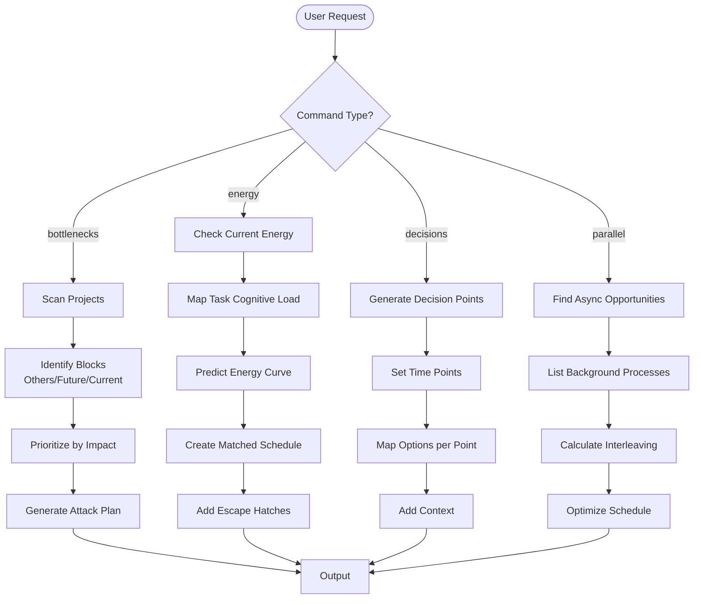

# GTD Skill Implementation Updates

## Quick Integration Guide

### 1. Add to Trigger Phrases (line ~25)

```markdown
## Trigger Phrases

- "let's plan my week" → Full weekly planning with tradeoff visualization
- "let's plan my day" → Daily planning for today
- "/gtd visualize-week" → Show this week's visual plan
- "/gtd visualize" → Show what's needed right now (today/current)
- "/gtd tradeoffs" → Show allocation options and tradeoffs
- "/gtd bottlenecks" → Find and attack blocking work  # NEW
- "/gtd energy" → Match tasks to energy states  # NEW
- "/gtd decisions" → Plan decision points instead of tasks  # NEW
- "/gtd parallel" → Identify parallel work opportunities  # NEW
- "help me organize my week"
- "help me prioritize"
- "what should I work on right now"
- "what's blocking me" → Bottleneck analysis  # NEW
- "match my energy" → Energy-based planning  # NEW
```

### 2. Update Decision Flow (line ~158)

Add new branches to the mermaid diagram:



### 3. Add Command Implementations (line ~235)

```markdown
## Commands

**`/gtd visualize-week`** - Weekly plan (capacity, active threads, momentum, daily allocation) + creates markdown/Notion page

**`/gtd visualize`** - Current focus (what's needed right now, next actions, energy match)

**`/gtd tradeoffs`** - Allocation options with full tradeoff analysis

**`/gtd bottlenecks`** - Analyze blocking work (NEW)
- Scans for work blocking others, future you, current you
- Prioritizes by impact and urgency
- Generates focused attack plan

**`/gtd energy`** - Energy-based task matching (NEW)
- Maps current energy to appropriate tasks
- Predicts energy trajectory for the day
- Provides escape hatches for low-energy periods

**`/gtd decisions`** - Decision buffer planning (NEW)
- Creates decision points instead of task lists
- Maps viable options to each time slot
- Preserves flexibility while maintaining structure

**`/gtd parallel`** - Parallel progress opportunities (NEW)
- Identifies long-running background processes
- Suggests optimal interleaving patterns
- Maximizes throughput via parallelization

**`/gtd plan --approach=[auto|decisions|bottlenecks|energy|parallel]`** - Intelligent planning with optional override (NEW)
- Default: auto-selects based on context
- Override: explicitly choose planning approach
```

### 4. Add Intelligence Layer (new section after line ~390)

```markdown
## Intelligent Planning Selection

The GTD skill now intelligently selects the best planning approach based on your context:

### Auto-Selection Logic

```python
def select_approach(context):
    # Morning with deadlines → Bottleneck hunting
    if context.time < "10am" and context.has_urgent_deadlines:
        return "bottlenecks"

    # Variable energy patterns → Energy arbitrage
    if context.energy_variability > 0.3:
        return "energy"

    # Multiple competing priorities → Decision buffer
    if len(context.active_projects) > 3 and context.priority_unclear:
        return "decisions"

    # Background processes available → Parallel progress
    if context.has_async_opportunities:
        return "parallel"

    # Default to hybrid approach
    return "hybrid"
```

### Context Signals

The skill monitors these signals to select approaches:

**Time signals:**
- Morning (before 10am): Favor bottleneck hunting
- Afternoon (2-4pm): Favor energy matching
- End of day: Favor parallel/cleanup tasks

**Project signals:**
- External deadlines present → Bottlenecks
- Multiple high-priority → Decisions
- Long-running available → Parallel

**Energy signals:**
- Post-coffee peak → Deep work matching
- Afternoon slump → Low-cognition tasks
- Variable pattern → Energy arbitrage

**Collaboration signals:**
- Teammates blocked → Bottleneck priority
- Async communication → Parallel opportunity
- Solo work time → Energy optimization

### Manual Override

You can always override the auto-selection:

```bash
/gtd plan --approach=decisions  # Force decision buffer
/gtd plan --approach=energy     # Force energy matching
```

Or ask directly:
- "I want to use decision buffers today"
- "Help me match tasks to my energy"
- "What's blocking my progress?"
```

### 5. Update Core Principles (line ~330)

```markdown
## Core Principles

**Decision Support:** Identify key edges (what matters most, what's blocking, what's realistic, what to say NO to) + provide supporting facts (even contradictory)

**Executive Function:** Working memory (externalize commitments) · Planning (break down, sequence, estimate) · Task initiation (smallest first step) · Time management (realistic + buffers) · Cognitive flexibility (pivot when needed)

**Anti-Sycophancy:** Lead with strongest objection FIRST, then acknowledge strengths. Prevents false validation, uncovers blind spots.

**Energy Management (NEW):** Match cognitive load to energy states · Provide escape hatches · Honor natural rhythms while respecting deadlines

**Bottleneck Focus (NEW):** Prioritize work that unblocks others · Clear future obstacles proactively · Remove current impediments

**Decision Preservation (NEW):** Defer decisions to optimal moments · Preserve optionality · Leverage decision-making strength

**Parallel Optimization (NEW):** Maximize throughput via background processes · Interleave work intelligently · Reduce idle time
```

### 6. Add Example Outputs (new section)

```markdown
## Example Planning Outputs

### Decision Buffer Example
```
📊 DECISION BUFFER - Thursday, April 3
━━━━━━━━━━━━━━━━━━━━━━━━━━━━━━━━━━━
9:00am  | Deep Focus vs Maintenance?
        | → BlueDot: 47% collusion analysis
        | → Skills: 3 updates pending
        | Energy: High ✅
        | Rec: Deep work window

11:00am | Continue vs Switch?
        | Current: [active thread]
        | Alt: Job board (deadline)
        | Switch cost: ~15 min

2:00pm  | High vs Low Cognition?
        | Energy: Medium-low ⚠️
        | → Feature dev (requires focus)
        | → Git commits (low cognition)
        | Rec: Low cognition + coffee

4:00pm  | Close Loops vs Explore?
        | → Finish: 2 tasks 80% done
        | → Explore: New research paper
        | Rec: Close loops first
```

### Bottleneck Analysis Example
```
🎯 BOTTLENECK ANALYSIS
━━━━━━━━━━━━━━━━━━━━━━━━━━
⛔ BLOCKING OTHERS (Critical):
1. BlueDot Session 3 prep
   → Anusha waiting
   → Due: Tomorrow
   → Time needed: 2 hours

🚧 BLOCKING FUTURE YOU:
2. Unindexed conversations (500+)
   → Search degrading
   → Growing daily
   → Time needed: 10 min (async)

🔒 BLOCKING CURRENT:
3. Missing Notion context
   → Can't prioritize
   → Quick fetch needed
   → Time needed: 30 seconds

ATTACK SEQUENCE:
Now: Fetch Notion (30s)
Next: Start indexing (background)
Then: BlueDot prep (2h focused)
```
```

## Integration Timeline

### Phase 1: Add Commands (Today)
- [ ] Add new trigger phrases to SKILL.md
- [ ] Update command list
- [ ] Link to planning-approaches.md reference

### Phase 2: Implement Logic (This Week)
- [ ] Add auto-selection logic
- [ ] Create output formatters
- [ ] Test with current context

### Phase 3: Refine (Ongoing)
- [ ] Track which approaches work best
- [ ] Adjust selection thresholds
- [ ] Add user preference storage

## Testing Checklist

Test each new command:
- [ ] `/gtd bottlenecks` - Shows blocking work correctly
- [ ] `/gtd energy` - Matches tasks to energy states
- [ ] `/gtd decisions` - Generates decision buffer
- [ ] `/gtd parallel` - Identifies background opportunities
- [ ] `/gtd plan` - Auto-selects appropriate approach

Test auto-selection:
- [ ] Morning with deadline → Selects bottlenecks
- [ ] Low afternoon energy → Selects energy matching
- [ ] Multiple priorities → Selects decision buffer
- [ ] Background available → Suggests parallel work